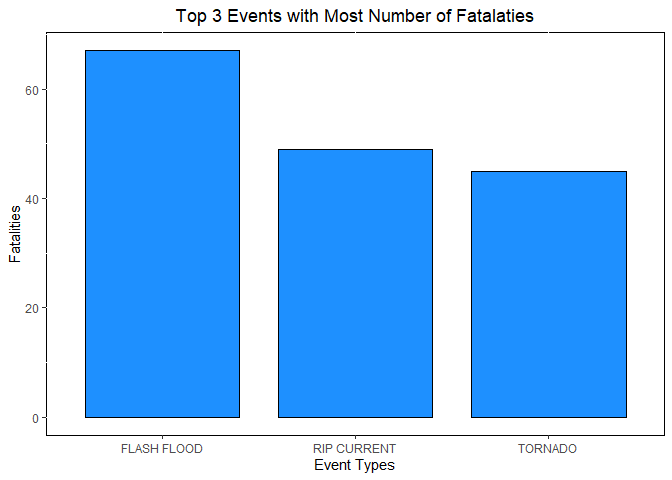
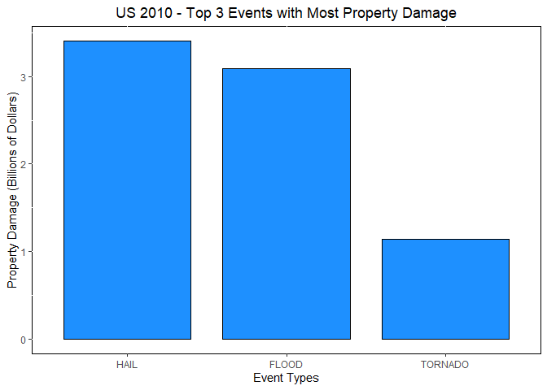

## Introduction
Storms and other severe weather events can cause both public health and economic problems for communities and municipalities. Many severe events can result in fatalities, injuries, and property damage, and preventing such outcomes to the extent possible is a key concern.

This project involves exploring the U.S. National Oceanic and Atmospheric Administration's (NOAA) storm database. This database tracks characteristics of major storms and weather events in the United States, including when and where they occur, as well as estimates of any fatalities, injuries, and prerty damage.

The analysis will focus on answering two questions.

1. Across the United States, which types of events (as indicated in the <span style="color: red;">EVTYPE</span> variable) are most harmful with respect to population health?
2. Across the United States, which types of events have the greatest economic consequences?

## Data Processing
The data for this assignment come in the form of a comma-separated-value file compressed via the bzip2 algorithm to reduce its size. You can download the file from the course web site:

- [Storm Data](https://d396qusza40orc.cloudfront.net/repdata%2Fdata%2FStormData.csv.bz2) [47Mb]

There is also some documentation of the database available. Here you will find how some of the variables are constructed/defined.

- National Weather Service [Storm Data Documentation](https://d396qusza40orc.cloudfront.net/repdata%2Fpeer2_doc%2Fpd01016005curr.pdf)
- National Climatic Data Center Storm Events [FAQ](https://d396qusza40orc.cloudfront.net/repdata%2Fpeer2_doc%2FNCDC%20Storm%20Events-FAQ%20Page.pdf)

The events in the database start in the year 1950 and end in November 2011. In the earlier years of the database there are generally fewer events recorded, most likely due to a lack of good records. More recent years should be considered more complete.

### Download Data
Download data from course website.

```r
library(curl)
url <- "https://d396qusza40orc.cloudfront.net/repdata%2Fdata%2FStormData.csv.bz2"
csv <- curl_download(url, "repdata_data_StormData.csv.bz2")
```

### Extract Data
Read the csv file into a data frame. 

```r
# read the csv into a data frame
df_full <- read.csv(csv, header = TRUE)
```


### Extract Dates
Extract dates so that data can be subsetted later on.

```r
library(lubridate)
df_full$date <- mdy_hms(df_full$BGN_DATE)
```

### Subset Data
Select year 2010 data for analysis. This data will contain a full year's worth of data and will be expected to be cleaner than older data. Ie. EVTYPE, PROPDMGEXP data will not need to be cleaned. Select only the Event Type, Fatalities, Property Damage, and Property Damage variables. This will make the dataset much smaller and faster for analysis. The downside to this is that only one year's worth of data will be included in the final results.

```r
library(dplyr)
df <- df_full %>% 
  select(EVTYPE, FATALITIES, PROPDMG, PROPDMGEXP, date) %>% 
  filter(date >= ymd("2010-01-01") & date <= ymd("2010-12-31"))
```

### Calculate Property Damage
Property damage will need to be calculated by multiplying the property damage variable by the Property Damage Exponent. In older data (before 2000), the Property Damage variable have alphanumeric characters. In newer data (after 2000), the letters "K", "M", and "B" represent thousands, millions, and billion dollars of damage.

The first step to calculate the property damange is to convert the letters K, M, and B to a numerical value. The second step is to divide the numbers by 10^9, so that the y-axis scale on the plot can be represented as billions of dollars.

```r
# show numbers as billions
df$property_dmg <- case_when(
  toupper(df$PROPDMGEXP) == "K" ~ df$PROPDMG * 10^3 / 10^9,
  toupper(df$PROPDMGEXP) == "M" ~ df$PROPDMG * 10^6 / 10^9,
  toupper(df$PROPDMGEXP) == "B" ~ df$PROPDMG,
  TRUE ~ df$PROPDMG / 10^9 # don't care about anything else because the magnitude is too low (for years <2000)
)
```

### Prepare Plot Data
To prepare the plot data, aggregate the property damage and fatalities, separately, by Event Type, and select the top 3 event types for each plot.

```r
# agg property damage, select top 3 events
pda <- aggregate(property_dmg ~ EVTYPE, df, sum) %>% arrange(desc(property_dmg)) %>% head(3)

# agg fatalities, select top 3 events
fa <- aggregate(FATALITIES ~ EVTYPE, df, sum) %>% arrange(desc(FATALITIES)) %>% head(3)
```

## Results
This analysis narrowed the focus of the NOAA storm database to year 2010. To highlight the importance of the events, the top 3 events were selected.

1. Across the United States, which types of events (as indicated in the <span style="color: red;">EVTYPE</span> variable) are most harmful with respect to population health?

  For this analysis, to keep the study focused and simple, I used fatalities as a measure of harm to population health. Based on fatalities, we conclude that the top three types of events in 2010, with the most damage to human health are  flash floods, rip currents, and tornadoes.
  
  ```r
  # plot fatalities
  ggplot(fa, aes(x = reorder(EVTYPE, -FATALITIES), y = FATALITIES)) + 
    ggtitle("Top 3 Events with Most Number of Fatalaties") +
    theme(plot.title = element_text(hjust = 0.5),  # centre text
      panel.background = element_rect(fill = "white", color = "black")) + 
    xlab("Event Types") +
    ylab("Fatalities") +
    geom_bar(stat = "identity", width = 0.8, colour="black", fill="dodgerblue")
  ```
  
  
  
  For further analysis, I could include more years of data and include injuries as well as fatalities.
  
2. Across the United States, which types of events have the greatest economic consequences?
  
  We can see from the plot below that, for the year 2010, the three events with the biggest property damage, and by proxy, economic consequences, are, in order, hail, floods, and tornadoes.

  I did not include crop damage as it requires separate analysis, nor did I include other years as I did not have inflation data.
  
  ```r
  library(ggplot2)
  # plot proptery damage
  ggplot(pda, aes(x = reorder(EVTYPE, -property_dmg), y = property_dmg)) + 
    ggtitle("Top 3 Events with Most Property Damage") +
    theme(plot.title = element_text(hjust = 0.5), # centre text
      panel.background = element_rect(fill = "white", color = "black")) + 
    xlab("Event Types") +
    ylab("Property Damage (Billions of Dollars)") +
    geom_bar(stat = "identity", width = 0.8, colour="black", fill="dodgerblue")
  ```
  
  
  In a follow-up study, I could include crop damage as well as property damage to measure impact to economy, as well as include more years in the study.
